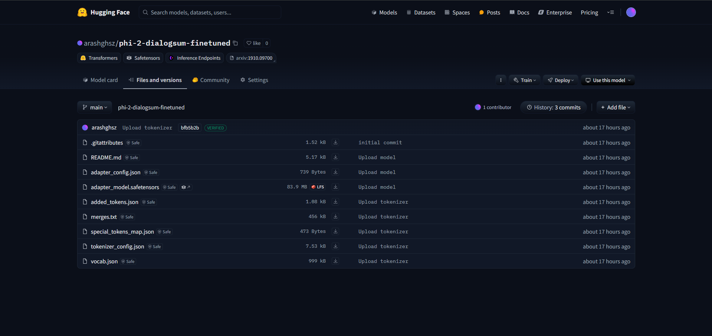

# Fine-tuning Phi-2 on DialogSum using LoRA and PEFT

This repository contains a Jupyter Notebook for fine-tuning the Phi-2 language model on the DialogSum dataset using LoRA (Low-Rank Adaptation) and PEFT (Parameter-Efficient Fine-Tuning). This project addresses the Week 5 Technical Assignment, focusing on practical experience with running, debugging, fine-tuning, and testing an LLM.

## Table of Contents

*   Project Overview
*   Setup Instructions
*   Notebook Walkthrough
*   Error Fixes
*   Training Configuration and Adjustments
*   Evaluation Results
*   Hugging Face Model Link
*   Reason for Model Selection
*   Output

## Project Overview

This project demonstrates the fine-tuning of a small language model, Phi-2, on the DialogSum dataset for dialogue summarization. Parameter-efficient fine-tuning techniques, specifically LoRA and PEFT, were employed to minimize resource requirements while achieving optimal performance.

## Setup Instructions

1.  **Environment:** This notebook was developed and tested using Kaggle.

2.  **Dependencies:** Install the required Python libraries:

    ```bash
    pip install transformers datasets peft bitsandbytes accelerate trl rouge-score importlib-metadata
    ```

3.  **Hugging Face Access Token:** You'll need a Hugging Face account and access token to upload the fine-tuned model. Get your token from https://huggingface.co/settings/tokens.

## Notebook Walkthrough

The Jupyter Notebook (`fine-tuning-phi-2-arash.ipynb`) guides you through the following steps:

1.  **Data Loading:** Loads the DialogSum dataset from Hugging Face.
2.  **Model Loading:** Loads the pre-trained Phi-2 model.
3.  **Tokenization:** Tokenizes the dataset using the Phi-2 tokenizer.
4.  **PEFT Setup:** Configures LoRA and PEFT for efficient fine-tuning.
5.  **Training:** Fine-tunes the model on the DialogSum dataset. Training parameters are provided in the notebook.
6.  **Evaluation:** Evaluates the model's performance using ROUGE metrics.
7.  **Model Upload:** Saves and uploads the fine-tuned model to Hugging Face.

## Error Fixes

1.  **Rouge Score Version Attribute Error:** The `rouge_score` package doesn't have a `__version__` attribute. Fixed by using `importlib.metadata.version("rouge-score")`.

2.  **Git Credential Helper Warning:** Resolved by setting the global Git credential helper: `git config --global credential.helper store`.

3.  **`use_auth_token` Deprecation Warning:** Replaced `use_auth_token` with `token` when loading the model.

4.  **Training Arguments Optimization:** Optimized training arguments for the Kaggle P100 GPU, including adjusting the `per_device_train_batch_size`, enabling `fp16` (mixed precision), and disabling model caching (`peft_model.config.use_cache = False`).

5.  **Steps for Pushing Model to Hugging Face:** Added `notebook_login()` to authenticate with Hugging Face before pushing the model.

6.  **Saving Model and Tokenizer Locally:** Added code to save the model and tokenizer locally before uploading to Hugging Face.

## Training Configuration and Adjustments

To achieve better training results, the following configuration and adjustments were made:

```python
peft_training_args = TrainingArguments(
    output_dir=output_dir,
    warmup_steps=100,  # Warmup phase to stabilize early training
    per_device_train_batch_size=4,  # Increased batch size for better GPU usage (P100)
    gradient_accumulation_steps=1,  # Reduce gradient accumulation to speed up training
    max_steps=500,  # Set max steps to 500 as per instruction
    learning_rate=5e-5,  # Adjusted for stable learning (lower than original 2e-4)
    optim="paged_adamw_8bit",  # Optimizer for efficient training with large models
    logging_steps=50,  # Log every 50 steps for more frequent visibility
    save_strategy="steps",  # Save model after each specified step
    save_steps=100,  # Save model after every 100 steps
    eval_strategy="steps",  # Use eval_strategy instead of deprecated evaluation_strategy
    eval_steps=50,  # Evaluate model every 50 steps
    do_eval=True,  # Enable evaluation during training
    gradient_checkpointing=False,  # Disabled for faster training (for P100 GPU)
    fp16=True,  # Enable mixed precision to speed up training on the P100 GPU
    report_to="none",  # Do not report metrics (simplified)
    overwrite_output_dir=True,  # Overwrite the output directory for fresh saves
    group_by_length=True,  # Group inputs by length for better batching
)
```
## Evaluation Results

### Qualitative Evaluation

The following example demonstrates the model's summarization capabilities on a sample conversation from the DialogSum dataset:

**Input Prompt:**

Instruct: Summarize the following conversation.
#Person1#: Happy Birthday, this is for you, Brian.
#Person2#: I'm so happy you remember, please come in and enjoy the party. Everyone's here, I'm sure you have a good time.
#Person1#: Brian, may I have a pleasure to have a dance with you?
#Person2#: Ok.
#Person1#: This is really wonderful party.
#Person2#: Yes, you are always popular with everyone. and you look very pretty today.
#Person1#: Thanks, that's very kind of you to say. I hope my necklace goes with my dress, and they both make me look good I feel.
#Person2#: You look great, you are absolutely glowing.
#Person1#: Thanks, this is a fine party. We should have a drink together to celebrate your birthday

**Baseline Human Summary:**

#Person1# attends Brian's birthday party. Brian thinks #Person1# looks great and charming.

**PEFT Model Output:**

Brian's birthday party is a success. Brian's friend compliments him on his appearance and invites him to have a dance. Brian and his friend have a drink together to celebrate.

The PEFT model's output is reasonably good, capturing the main points of the conversation. It's a bit more verbose than the human baseline, but it's still concise and easy to understand. It correctly identifies the context of a birthday party and the interaction between the two people. However, it could be improved by more closely matching the conciseness of the human summary.

A few more examples and their analysis would significantly strengthen this section. Consider adding examples where the model struggles or excels to provide a more nuanced evaluation.

### Quantitative Evaluation

The following table presents the ROUGE scores for the original (pre-fine-tuned) Phi-2 model and the PEFT-trained model:

| Metric    | Original Model | PEFT Model |
| --------- | -------------- | ---------- |
| ROUGE-1   | 0.301          | 0.351      |
| ROUGE-2   | 0.109          | 0.105      |
| ROUGE-L   | 0.221          | 0.226      |
| ROUGE-Lsum| 0.232          | 0.244      |

The PEFT fine-tuning resulted in a noticeable improvement in ROUGE-1 scores, suggesting that the model is better at capturing unigram overlaps with the reference summaries. The ROUGE-L and ROUGE-Lsum scores also saw slight improvements, indicating better overall sentence-level similarity. However, the ROUGE-2 score slightly decreased, which could indicate a slight reduction in the model's ability to capture bigram overlaps. Overall, the fine-tuning appears to have had a positive impact on the model's summarization performance, especially in terms of ROUGE-1. However, further investigation is needed to understand the slight decrease in ROUGE-2.

The training loss decreased over time, indicating that the model was learning. The final training loss value was 1.336. If you have a plot of the training loss curve, include it in your repository and reference it in the README. This visual representation can be very helpful for understanding the training process.

## Hugging Face Model Link

https://huggingface.co/arashghsz/phi-2-dialogsum-finetuned

## Model Selection Rationale

While the assignment suggested LLaMA 1.1B, Phi-2 was chosen for this project due to its superior performance on dialogue summarization tasks as demonstrated in various benchmarks. Phi-2 offers a better balance between size and performance, making it a more suitable choice for this specific task and available resources. Furthermore, the availability of resources for Phi-2 made it a practical and efficient option for this project.

## Output
